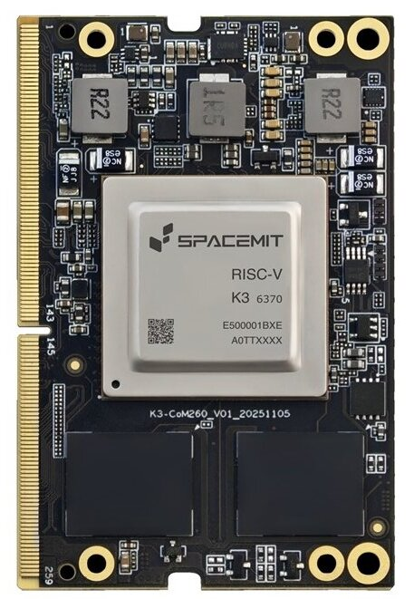
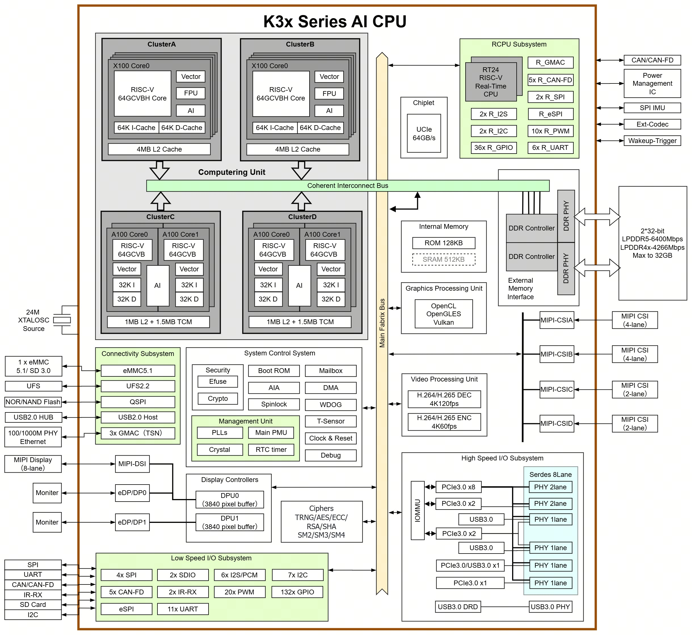

# K3 Documentation Collection

***This Doc is WIP***

## What is K3?
K3 stands for the RISC-V based K3 SoC from SpacemiT [overview](https://www.spacemit.com/community/document/info?lang=en&nodepath=hardware/key_stone/k3/k3_docs/root_overview.md)
It's a successor to their K1 SoC featuring 4 CPU clusters, including 2 X100 clusters (4 cores each), and 2 A100 clusters (4 cores each) -- 16 CPUs in total.
The X100 is intended for general purpose compute (H extension + 256 vlen) and A100 for "AI" (no H extension, 1024 vlen). More details in [paper](./soc/k3.pdf)

| K3 in CoM260 | K3 Block Diagram |
| ------------ | ---------------- |
|  |  |

Based on my analysis of their [OpenSBI patch v2](https://lore.kernel.org/opensbi/20260818-spacemit-k3-v2-0-84cb7773a481@linux.spacemit.com/T/#t) and
[rvtrace RFC patch](https://lore.kernel.org/all/20260414034153.3272485-1-liangzhen@linux.spacemit.com/), K3 is similar to K1 in that it's based on some ARM SoC design where SpacemiT just
replaced the ARM core with RISC-V and reused many of the fabrics, including the cache coherency manager and trace components. It's not build entirely from ground up.

## New!! Hacking guide for firmware developers
Refer to [README](./hacking/README.md)

## On the Market
There're essentially 2 boards that regular users can buy:
 * [K3 Pico-ITX](https://www.spacemit.com/community/document/info?lang=en&nodepath=hardware/eco/k3_pico/pico_user_guide.md): good for regular use: available with proper case (NUC alike); decent cooling; SFP+ port.
 * [K3 CoM260](https://www.spacemit.com/community/document/info?lang=en&nodepath=hardware/eco/k3_com260/com260_user_guide.md): good for advanced users, debugging: Jetson Orin nano compatible; 12V DC in; JTAG from microSD slot.

## SoC Docs
There's no official TRM being published yet. Only datasheets and design documents [here](https://github.com/spacemit-com/docs-chip/blob/main/en/key_stone/k3/index.md). They are not
enough to do meaningful firmware/driver development, but still better than nothing.

## Board Docs
SpacemiT maintains very good documentation of board docs [here](https://github.com/spacemit-com/docs-product/blob/main/en/index.md), including Pico-ITX and CoM260.

