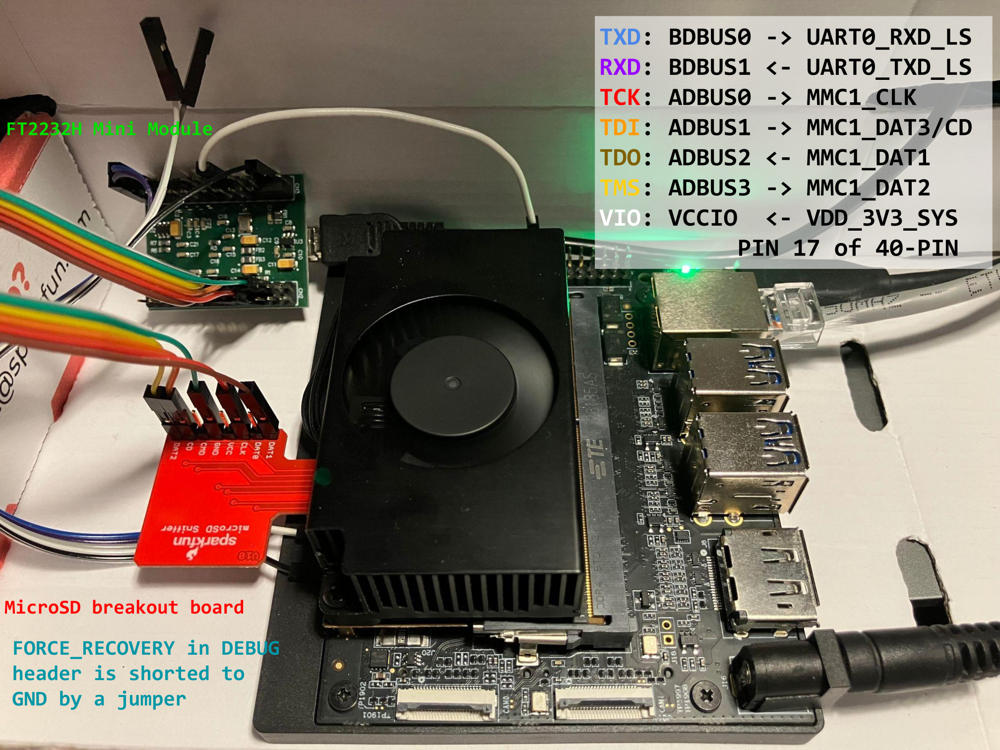

# JTAG on COM260

 

## Parts:

* [K3 CoM260](https://docs.banana-pi.org/en/BPI-SM10/BananaPi_BPI-SM10)
* [FT2232H Mini Module](https://ftdichip.com/products/ft2232h-mini-module/)
* [SparkFun MicroSD sniffer](https://www.sparkfun.com/sparkfun-microsd-sniffer.html)

## JTAG Pins

To my best knowledge, CoM260 only has the JTAG pins exposed on the module (core) board, code name SM10. There's no JTAG pins
on the base board. From K3 chip pinouts, JTAG can be either connected to JTAG pins in the PMIC pin group, or the MMC1 pins.
The MMC1 pins is perhaps the only viable way if we don't want to hack the board and solder wires. The reason we can use MMC1 pins
for JTAG is because they are multiplexed into multiple functions. (Every pin on K3 is multiplexed up to 8 predefined functions)
Function 5 of MMC1 pins are:
| Pin | Function 5 |
| --- | ---------- |
|MMC1_DAT3|PRI_TDI|
|MMC1_DAT2|PRI_TMS|
|MMC1_DAT1|PRI_TDO|
|MMC1_CLK|PRI_TCK|

***Note that no TRST is exposed through MMC1 pins***

The multiplexing of pins are controlled by pinctrl block at `0xd401e000`. Each pin has a corresponding 32-bit [pinctrl register](https://elixir.bootlin.com/linux/v7.2/source/Documentation/devicetree/bindings/pinctrl/spacemit,k1-pinctrl.yaml), in which there
is a 3-bit field controlling the function (0-7) that the pin connects to. At reset, the default function is 0 for MMC1 pins, so
they need to be switched to Function 5. Vendor u-boot has a convenient device-tree property [`spacemit,enable-debug-jtag`](https://github.com/spacemit-com/uboot-2022.10/blob/769ed686043d06b65c2863af479e97985e3b0d64/arch/riscv/dts/k3_spl.dts#L28) that
controls the switch in SPL. Un-comment that line, and don't forget to disable mmc1(sdhci1) in u-boot proper and Linux device-tree
so the pinmux won't get switched back.

## JTAG Connection

I'm using a FT2232H Mini Module for JTAG. It's cheap, and OpenOCD has decent support. Connect the pins as shown:
```
TXD: BDBUS0 -> UART0_RXD_LS
RXD: BDBUS1 <- UART0_TXD_LS
TCK: ADBUS0 -> MMC1_CLK
TDI: ADBUS1 -> MMC1_DAT3/CD
TDO: ADBUS2 <- MMC1_DAT1
TMS: ADBUS3 -> MMC1_DAT2
VIO: VCCIO  <- VDD_3V3_SYS (PIN 17 of 40-PIN)

!!!Use VCCIO from the COM260 Board's VDD_3V3_SYS board to avoid power backfeeding!!!
```

This setup conveniently gives us both the debug UART0 and JTAG through the same USB converter. Note that the VCCIO of
FT2232H needs to be feed from COM260's 3V3 to avoid FT2232H backfeeding power back when COM260 is powered-off. Otherwise,
you'll get some random garbage characters in the UART console when COM260 is turned off. The backfeeding can also confuse
the PMIC or something on the board, that K3 has some possibility to not turning on when 12V is re-connected.

This however, creates another challenge. When the FT2232H is first connected without COM260 power-on, there's no VCCIO, and for
some reason the FT2232H mistakenly reports itself as a Quad RS232-HS:
```
usb 3-1.2: new high-speed USB device number 9 using xhci_hcd
usb 3-1.2: config 1 interface 1 altsetting 0 bulk endpoint 0x83 has invalid maxpacket 64
usb 3-1.2: config 1 interface 1 altsetting 0 bulk endpoint 0x4 has invalid maxpacket 64
usb 3-1.2: New USB device found, idVendor=0403, idProduct=6011, bcdDevice= 8.00
usb 3-1.2: New USB device strings: Mfr=1, Product=2, SerialNumber=0
usb 3-1.2: Product: Quad RS232-HS
usb 3-1.2: Manufacturer: FTDI
```

To workaround this, power-on COM260, and do a `usbreset` of this "Quad RS232-HS" device. It'll then behave properly and enumerated as FT2232H:
```
usb 3-1.1: new high-speed USB device number 10 using xhci_hcd
usb 3-1.1: New USB device found, idVendor=0403, idProduct=6010, bcdDevice= 7.00
usb 3-1.1: New USB device strings: Mfr=1, Product=2, SerialNumber=3
usb 3-1.1: Product: FT2232H MiniModule
usb 3-1.1: Manufacturer: FTDI
usb 3-1.1: SerialNumber: FT80197L
```

Once the FT2232H is properly probed, COM260 can be turned off/on at will, and not causing issues with FT2232H.
